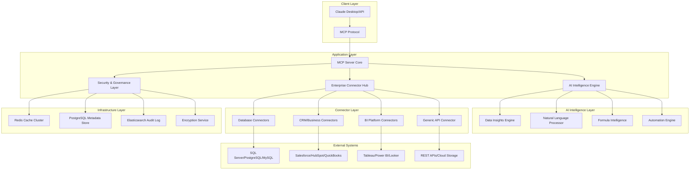

# Google Sheets MCP Server - Phase 2 Technical Specification
## Enterprise-Grade AI Intelligence & Connectors

**Document Version**: 1.0
**Classification**: Internal Technical Specification
**Target Audience**: Senior Engineering, Architecture Review Board
**Approval Required**: CTO, VP Engineering, Lead Architect

---

## 1. Executive Summary

This technical specification outlines the architecture and implementation strategy for Phase 2 enhancements to the Google Sheets MCP Server, transforming it into an enterprise-grade AI-native spreadsheet automation platform. The scope encompasses advanced AI intelligence capabilities and comprehensive enterprise system integrations.

**Business Impact**: Enable Fortune 500 enterprises to automate complex spreadsheet workflows with AI assistance while maintaining seamless integration with existing enterprise data infrastructure.

**Technical Scope**: 47 new enterprise-grade tools across AI intelligence and system connectors.

---

## 2. Architecture Overview

### 2.1 High-Level System Architecture



### 2.2 Core Technology Stack

| Component | Technology | Version | Justification |
|-----------|------------|---------|---------------|
| **Runtime** | Node.js | 20.x LTS | Performance, ecosystem, TypeScript support |
| **Language** | TypeScript | 5.3+ | Type safety, enterprise maintainability |
| **AI/ML Framework** | TensorFlow.js | 4.x | Client-side ML, Google Sheets integration |
| **Data Processing** | Apache Arrow | 14.x | High-performance columnar data processing |
| **Caching** | Redis | 7.x | Distributed caching, session management |
| **Database** | PostgreSQL | 16.x | ACID compliance, JSON support, reliability |
| **Search/Analytics** | Elasticsearch | 8.x | Audit logging, query analytics, insights |
| **Security** | Node.js crypto | Native | Enterprise encryption, key management |
| **Monitoring** | Prometheus + Grafana | Latest | Observability, performance metrics |

---

## 3. Phase 2A: AI Intelligence Engine

### 3.1 Data Insights Engine

#### 3.1.1 Core Architecture

```typescript
interface DataInsightsEngine {
  // Statistical Analysis
  analyzeDataPatterns(data: DataMatrix): Promise<PatternAnalysis>;
  detectAnomalies(data: DataMatrix, config: AnomalyConfig): Promise<AnomalyResult[]>;
  calculateStatistics(data: DataMatrix): Promise<StatisticalSummary>;

  // Trend Analysis
  analyzeTrends(data: TimeSeries): Promise<TrendAnalysis>;
  forecastValues(data: TimeSeries, config: ForecastConfig): Promise<ForecastResult>;
  detectSeasonality(data: TimeSeries): Promise<SeasonalityResult>;

  // Data Quality
  assessDataQuality(data: DataMatrix): Promise<QualityAssessment>;
  suggestDataCleanup(data: DataMatrix): Promise<CleanupSuggestion[]>;
  detectDataTypes(data: DataMatrix): Promise<TypeInference[]>;
}
```

#### 3.1.2 Statistical Analysis Implementation

**Technology**: TensorFlow.js + Custom Statistical Libraries

```typescript
class StatisticalAnalysisEngine {
  private tfModel: tf.LayersModel;

  async analyzeDataPatterns(data: DataMatrix): Promise<PatternAnalysis> {
    // Correlation Analysis
    const correlationMatrix = this.calculateCorrelationMatrix(data);

    // Distribution Analysis
    const distributions = await this.analyzeDistributions(data);

    // Clustering Analysis
    const clusters = await this.performClustering(data);

    // Outlier Detection using Multiple Methods
    const outliers = await this.detectOutliers(data, {
      methods: ['zscore', 'iqr', 'isolation_forest', 'local_outlier_factor'],
      threshold: 0.05
    });

    return {
      correlations: correlationMatrix,
      distributions,
      clusters,
      outliers,
      summary: this.generatePatternSummary(correlationMatrix, distributions, clusters)
    };
  }

  private async detectOutliers(data: DataMatrix, config: OutlierConfig): Promise<OutlierResult[]> {
    const results: OutlierResult[] = [];

    // Z-Score Method
    if (config.methods.includes('zscore')) {
      const zScores = this.calculateZScores(data);
      results.push(...this.identifyZScoreOutliers(zScores, 3.0));
    }

    // Isolation Forest (TensorFlow.js implementation)
    if (config.methods.includes('isolation_forest')) {
      const isolationScores = await this.isolationForest(data);
      results.push(...this.identifyIsolationOutliers(isolationScores, config.threshold));
    }

    // Local Outlier Factor
    if (config.methods.includes('local_outlier_factor')) {
      const lofScores = this.calculateLOF(data);
      results.push(...this.identifyLOFOutliers(lofScores, config.threshold));
    }

    return this.consolidateOutlierResults(results);
  }
}
```

#### 3.1.3 Time Series Analysis

**Technology**: Custom implementation with seasonal decomposition

```typescript
class TimeSeriesEngine {
  async analyzeTrends(data: TimeSeries): Promise<TrendAnalysis> {
    // Seasonal Decomposition
    const decomposition = this.seasonalDecompose(data);

    // Trend Detection
    const trendDirection = this.detectTrendDirection(decomposition.trend);
    const trendStrength = this.calculateTrendStrength(decomposition.trend);

    // Change Point Detection
    const changePoints = this.detectChangePoints(data);

    // Stationarity Testing
    const stationarity = this.testStationarity(data);

    return {
      trend: {
        direction: trendDirection,
        strength: trendStrength,
        significance: this.calculateTrendSignificance(decomposition.trend)
      },
      seasonality: {
        present: decomposition.seasonal.length > 0,
        period: this.detectSeasonalPeriod(decomposition.seasonal),
        strength: this.calculateSeasonalStrength(decomposition.seasonal)
      },
      changePoints,
      stationarity,
      summary: this.generateTrendSummary(trendDirection, trendStrength, changePoints)
    };
  }

  async forecastValues(data: TimeSeries, config: ForecastConfig): Promise<ForecastResult> {
    // Multiple forecasting methods
    const methods: ForecastMethod[] = ['arima', 'exponential_smoothing', 'linear_trend'];
    const forecasts: ForecastMethodResult[] = [];

    for (const method of methods) {
      try {
        const forecast = await this.applyForecastMethod(data, method, config);
        forecasts.push({
          method,
          forecast,
          accuracy: this.calculateForecastAccuracy(data, forecast),
          confidence: this.calculateConfidenceIntervals(forecast)
        });
      } catch (error) {
        console.warn(`Forecast method ${method} failed:`, error);
      }
    }

    // Ensemble forecasting
    const ensembleForecast = this.createEnsembleForecast(forecasts);

    return {
      primary: ensembleForecast,
      alternatives: forecasts,
      recommendation: this.selectBestForecast(forecasts),
      metadata: {
        dataPoints: data.length,
        forecastHorizon: config.horizon,
        confidence: config.confidenceLevel || 0.95
      }
    };
  }
}
```

### 3.2 Natural Language Processing Engine

#### 3.2.1 Query Understanding Architecture

```typescript
interface NaturalLanguageEngine {
  // Query Processing
  parseNaturalQuery(query: string, context: SpreadsheetContext): Promise<QueryIntent>;
  generateSQLFromNL(query: string, schema: SchemaInfo): Promise<SQLQuery>;
  generateFormulaFromNL(description: string, context: CellContext): Promise<FormulaResult>;

  // Response Generation
  explainResults(results: any[], query: string): Promise<NaturalLanguageExplanation>;
  generateInsightNarrative(insights: DataInsights): Promise<string>;
  createExecutiveSummary(data: SpreadsheetData): Promise<ExecutiveSummary>;
}
```

#### 3.2.2 Intent Recognition System

**Technology**: Transformer-based NLP with fine-tuning for spreadsheet domain

```typescript
class IntentRecognitionEngine {
  private intentClassifier: tf.LayersModel;
  private entityExtractor: tf.LayersModel;

  async parseNaturalQuery(query: string, context: SpreadsheetContext): Promise<QueryIntent> {
    // Tokenization and preprocessing
    const tokens = this.tokenizeQuery(query);
    const embeddings = await this.generateEmbeddings(tokens);

    // Intent classification
    const intentProbabilities = await this.intentClassifier.predict(embeddings) as tf.Tensor;
    const intentScores = await intentProbabilities.data();

    const primaryIntent = this.selectPrimaryIntent(intentScores);

    // Entity extraction
    const entities = await this.extractEntities(query, context);

    // Confidence scoring
    const confidence = this.calculateConfidence(intentScores, entities);

    return {
      intent: primaryIntent,
      entities,
      confidence,
      parameters: this.extractParameters(query, primaryIntent, entities),
      clarificationNeeded: confidence < 0.8,
      suggestedClarifications: confidence < 0.8 ? this.generateClarifications(query, context) : []
    };
  }

  private async extractEntities(query: string, context: SpreadsheetContext): Promise<Entity[]> {
    const entities: Entity[] = [];

    // Column/Range detection
    const columnMentions = this.detectColumnReferences(query, context.columns);
    entities.push(...columnMentions.map(col => ({ type: 'column', value: col, confidence: 0.9 })));

    // Value detection
    const values = this.extractValues(query);
    entities.push(...values);

    // Operation detection
    const operations = this.detectOperations(query);
    entities.push(...operations);

    // Time references
    const timeEntities = this.extractTimeReferences(query);
    entities.push(...timeEntities);

    return entities;
  }
}
```

#### 3.2.3 Formula Generation from Natural Language

```typescript
class FormulaGenerationEngine {
  private formulaTemplates: Map<string, FormulaTemplate>;

  constructor() {
    this.initializeFormulaTemplates();
  }

  async generateFormulaFromNL(description: string, context: CellContext): Promise<FormulaResult> {
    // Parse the description
    const intent = await this.parseFormulaIntent(description);

    // Match to template
    const template = this.matchTemplate(intent);

    if (!template) {
      return this.handleComplexFormula(description, context);
    }

    // Generate formula
    const formula = this.instantiateTemplate(template, intent.parameters, context);

    // Validate formula
    const validation = await this.validateFormula(formula, context);

    return {
      formula,
      explanation: this.generateExplanation(formula, description),
      confidence: template.confidence * validation.confidence,
      alternatives: validation.alternatives || [],
      warnings: validation.warnings || []
    };
  }

  private initializeFormulaTemplates(): void {
    this.formulaTemplates.set('sum_with_criteria', {
      pattern: /sum.*where|total.*if|add.*when/i,
      template: '=SUMIFS({sum_range}, {criteria_range1}, {criteria1}, {criteria_range2}, {criteria2})',
      parameters: ['sum_range', 'criteria_range1', 'criteria1'],
      confidence: 0.95,
      examples: ['sum sales where region is north', 'total revenue if product is widget']
    });

    this.formulaTemplates.set('average_with_criteria', {
      pattern: /average.*where|mean.*if/i,
      template: '=AVERAGEIFS({average_range}, {criteria_range1}, {criteria1})',
      parameters: ['average_range', 'criteria_range1', 'criteria1'],
      confidence: 0.9,
      examples: ['average score where grade is A']
    });

    this.formulaTemplates.set('lookup_value', {
      pattern: /find|lookup|get.*from|search/i,
      template: '=INDEX({return_range}, MATCH({lookup_value}, {lookup_range}, 0))',
      parameters: ['return_range', 'lookup_value', 'lookup_range'],
      confidence: 0.85,
      examples: ['find price for product code ABC']
    });

    // Add 50+ more templates for comprehensive coverage
  }

  private async handleComplexFormula(description: string, context: CellContext): Promise<FormulaResult> {
    // For complex formulas, use ML model
    const embedding = await this.generateDescriptionEmbedding(description);
    const prediction = await this.complexFormulaModel.predict(embedding);

    const formula = this.decodeFormulaPrediction(prediction, context);

    return {
      formula,
      explanation: `Generated using AI model for: ${description}`,
      confidence: 0.7, // Lower confidence for ML-generated formulas
      alternatives: [],
      warnings: ['This formula was generated using AI. Please verify the logic.']
    };
  }
}
```

### 3.3 Advanced Formula Intelligence

#### 3.3.1 Formula Debugging Engine

```typescript
class FormulaDebuggingEngine {
  async debugFormula(formula: string, context: CellContext): Promise<DebugResult> {
    // Parse formula into AST
    const ast = this.parseFormulaAST(formula);

    // Step-by-step evaluation
    const steps = await this.evaluateStepByStep(ast, context);

    // Error detection
    const errors = this.detectErrors(ast, context);

    // Performance analysis
    const performance = this.analyzePerformance(ast, context);

    // Suggestions for improvement
    const suggestions = this.generateImprovementSuggestions(ast, errors, performance);

    return {
      steps,
      errors,
      performance,
      suggestions,
      visualization: this.createFormulaVisualization(ast, steps)
    };
  }

  private async evaluateStepByStep(ast: FormulaAST, context: CellContext): Promise<EvaluationStep[]> {
    const steps: EvaluationStep[] = [];

    const evaluate = async (node: ASTNode): Promise<any> => {
      switch (node.type) {
        case 'function':
          const args = await Promise.all(node.arguments.map(evaluate));
          const result = await this.evaluateFunction(node.name, args, context);

          steps.push({
            expression: this.nodeToString(node),
            operation: `${node.name}(${args.join(', ')})`,
            result,
            type: 'function_call',
            dependencies: node.arguments.map(arg => this.nodeToString(arg))
          });

          return result;

        case 'reference':
          const cellValue = await this.getCellValue(node.reference, context);

          steps.push({
            expression: node.reference,
            operation: `Get value from ${node.reference}`,
            result: cellValue,
            type: 'cell_reference',
            dependencies: []
          });

          return cellValue;

        case 'operator':
          const left = await evaluate(node.left);
          const right = await evaluate(node.right);
          const opResult = this.evaluateOperator(node.operator, left, right);

          steps.push({
            expression: `${left} ${node.operator} ${right}`,
            operation: `Apply operator ${node.operator}`,
            result: opResult,
            type: 'operator',
            dependencies: [this.nodeToString(node.left), this.nodeToString(node.right)]
          });

          return opResult;

        default:
          return node.value;
      }
    };

    await evaluate(ast.root);
    return steps;
  }
}
```

#### 3.3.2 Performance Analysis Engine

```typescript
class FormulaPerformanceEngine {
  analyzePerformance(ast: FormulaAST, context: CellContext): PerformanceAnalysis {
    const analysis: PerformanceAnalysis = {
      complexity: this.calculateComplexity(ast),
      estimatedExecutionTime: this.estimateExecutionTime(ast, context),
      memoryUsage: this.estimateMemoryUsage(ast, context),
      bottlenecks: this.identifyBottlenecks(ast, context),
      optimizations: []
    };

    // Identify optimization opportunities
    analysis.optimizations = this.identifyOptimizations(ast, analysis);

    return analysis;
  }

  private identifyOptimizations(ast: FormulaAST, analysis: PerformanceAnalysis): Optimization[] {
    const optimizations: Optimization[] = [];

    // Check for VLOOKUP -> INDEX/MATCH optimization
    const vlookupNodes = this.findVLookupNodes(ast);
    vlookupNodes.forEach(node => {
      optimizations.push({
        type: 'function_replacement',
        description: 'Replace VLOOKUP with INDEX/MATCH for better performance',
        originalExpression: this.nodeToString(node),
        optimizedExpression: this.convertVLookupToIndexMatch(node),
        estimatedImprovement: '30-50% faster execution',
        complexity: 'medium'
      });
    });

    // Check for array formula opportunities
    const repetitivePatterns = this.findRepetitivePatterns(ast);
    repetitivePatterns.forEach(pattern => {
      optimizations.push({
        type: 'array_formula',
        description: 'Use array formula to reduce calculation overhead',
        originalExpression: pattern.expression,
        optimizedExpression: `=ARRAYFORMULA(${pattern.optimized})`,
        estimatedImprovement: '60-80% faster for large ranges',
        complexity: 'high'
      });
    });

    // Check for unnecessary recalculations
    const volatileFunctions = this.findVolatileFunctions(ast);
    volatileFunctions.forEach(func => {
      optimizations.push({
        type: 'volatility_reduction',
        description: `Replace volatile function ${func.name} with static alternative`,
        originalExpression: this.nodeToString(func),
        optimizedExpression: this.suggestNonVolatileAlternative(func),
        estimatedImprovement: 'Reduces unnecessary recalculations',
        complexity: 'low'
      });
    });

    return optimizations;
  }
}
```

### 3.4 Smart Automation Engine

#### 3.4.1 Workflow Builder Architecture

```typescript
interface SmartAutomationEngine {
  // Workflow Management
  createWorkflow(definition: WorkflowDefinition): Promise<Workflow>;
  executeWorkflow(workflowId: string, context: ExecutionContext): Promise<ExecutionResult>;
  scheduleWorkflow(workflowId: string, schedule: ScheduleConfig): Promise<ScheduledJob>;

  // Smart Triggers
  createSmartTrigger(config: TriggerConfig): Promise<Trigger>;
  monitorDataChanges(ranges: string[], callback: ChangeCallback): Promise<Monitor>;

  // AI-Powered Optimizations
  optimizeWorkflow(workflow: Workflow): Promise<OptimizedWorkflow>;
  suggestAutomations(spreadsheet: SpreadsheetAnalysis): Promise<AutomationSuggestion[]>;
}
```

#### 3.4.2 Intelligent Trigger System

```typescript
class IntelligentTriggerSystem {
  private triggerEngine: Map<string, TriggerHandler>;
  private eventQueue: EventQueue;

  async createSmartTrigger(config: TriggerConfig): Promise<Trigger> {
    const trigger: Trigger = {
      id: this.generateTriggerId(),
      type: config.type,
      conditions: this.processConditions(config.conditions),
      actions: config.actions,
      metadata: {
        created: new Date(),
        lastExecuted: null,
        executionCount: 0,
        enabled: true
      }
    };

    // Set up monitoring based on trigger type
    switch (config.type) {
      case 'data_change':
        await this.setupDataChangeMonitoring(trigger, config);
        break;

      case 'threshold_breach':
        await this.setupThresholdMonitoring(trigger, config);
        break;

      case 'schedule':
        await this.setupScheduledTrigger(trigger, config);
        break;

      case 'ai_anomaly':
        await this.setupAnomalyDetectionTrigger(trigger, config);
        break;
    }

    this.triggerEngine.set(trigger.id, new TriggerHandler(trigger));
    return trigger;
  }

  private async setupAnomalyDetectionTrigger(trigger: Trigger, config: TriggerConfig): Promise<void> {
    const anomalyDetector = new AnomalyDetector({
      sensitivity: config.anomalyConfig?.sensitivity || 0.8,
      algorithm: config.anomalyConfig?.algorithm || 'isolation_forest',
      trainingPeriod: config.anomalyConfig?.trainingPeriod || '30d'
    });

    // Set up continuous monitoring
    const monitor = setInterval(async () => {
      try {
        const data = await this.fetchDataForAnalysis(config.dataRange);
        const anomalies = await anomalyDetector.detect(data);

        if (anomalies.length > 0 && this.evaluateConditions(trigger.conditions, { anomalies })) {
          await this.executeTriggerActions(trigger, { anomalies, data });
        }
      } catch (error) {
        console.error(`Anomaly detection trigger ${trigger.id} failed:`, error);
        await this.handleTriggerError(trigger, error);
      }
    }, config.anomalyConfig?.checkInterval || 300000); // 5 minutes default

    trigger.metadata.monitorHandle = monitor;
  }
}
```

---

## 4. Phase 2B: Enterprise Connector Hub

### 4.1 Database Integration Layer

#### 4.1.1 Universal Database Connector

```typescript
interface DatabaseConnector {
  // Connection Management
  connect(config: DatabaseConfig): Promise<Connection>;
  testConnection(config: DatabaseConfig): Promise<ConnectionTest>;
  disconnect(connectionId: string): Promise<void>;

  // Query Operations
  executeQuery(connectionId: string, query: SQLQuery): Promise<QueryResult>;
  executeBatch(connectionId: string, queries: SQLQuery[]): Promise<BatchResult>;

  // Schema Operations
  getSchema(connectionId: string): Promise<DatabaseSchema>;
  getTables(connectionId: string): Promise<TableInfo[]>;
  getColumns(connectionId: string, tableName: string): Promise<ColumnInfo[]>;

  // Data Synchronization
  setupSync(config: SyncConfig): Promise<SyncJob>;
  executeSync(syncJobId: string): Promise<SyncResult>;
  monitorSync(syncJobId: string): Promise<SyncStatus>;
}
```

#### 4.1.2 Multi-Database Support Implementation

```typescript
class UniversalDatabaseConnector {
  private connectionPool: Map<string, DatabaseConnection>;
  private drivers: Map<DatabaseType, DatabaseDriver>;

  constructor() {
    this.initializeDrivers();
  }

  private initializeDrivers(): void {
    this.drivers.set('postgresql', new PostgreSQLDriver());
    this.drivers.set('mysql', new MySQLDriver());
    this.drivers.set('sqlserver', new SQLServerDriver());
    this.drivers.set('oracle', new OracleDriver());
    this.drivers.set('snowflake', new SnowflakeDriver());
    this.drivers.set('bigquery', new BigQueryDriver());
    this.drivers.set('redshift', new RedshiftDriver());
  }

  async connect(config: DatabaseConfig): Promise<Connection> {
    const driver = this.drivers.get(config.type);
    if (!driver) {
      throw new Error(`Unsupported database type: ${config.type}`);
    }

    // Validate configuration
    await this.validateConfig(config);

    // Create secure connection
    const connection = await driver.createConnection({
      ...config,
      ssl: config.ssl || this.getDefaultSSLConfig(config.type),
      pool: {
        min: config.pool?.min || 2,
        max: config.pool?.max || 10,
        acquireTimeoutMillis: config.pool?.acquireTimeout || 30000,
        createTimeoutMillis: config.pool?.createTimeout || 30000,
        idleTimeoutMillis: config.pool?.idleTimeout || 600000
      }
    });

    // Test connection
    await this.testConnection(connection);

    // Store in pool
    const connectionId = this.generateConnectionId();
    this.connectionPool.set(connectionId, {
      id: connectionId,
      driver,
      connection,
      config,
      created: new Date(),
      lastUsed: new Date()
    });

    return {
      id: connectionId,
      type: config.type,
      host: config.host,
      database: config.database,
      status: 'connected'
    };
  }

  async executeQuery(connectionId: string, query: SQLQuery): Promise<QueryResult> {
    const conn = this.connectionPool.get(connectionId);
    if (!conn) {
      throw new Error(`Connection ${connectionId} not found`);
    }

    // Security validation
    await this.validateQuery(query);

    // Query optimization
    const optimizedQuery = await this.optimizeQuery(query, conn.config.type);

    // Execute with timeout and monitoring
    const startTime = Date.now();
    try {
      const result = await Promise.race([
        conn.driver.executeQuery(conn.connection, optimizedQuery),
        this.createQueryTimeout(query.timeout || 300000)
      ]);

      const executionTime = Date.now() - startTime;

      // Log query performance
      await this.logQueryPerformance({
        connectionId,
        query: optimizedQuery,
        executionTime,
        rowCount: result.rows.length,
        success: true
      });

      conn.lastUsed = new Date();

      return {
        rows: result.rows,
        columns: result.columns,
        metadata: {
          executionTime,
          rowCount: result.rows.length,
          queryId: this.generateQueryId()
        }
      };

    } catch (error) {
      const executionTime = Date.now() - startTime;

      await this.logQueryPerformance({
        connectionId,
        query: optimizedQuery,
        executionTime,
        error: error.message,
        success: false
      });

      throw new DatabaseError(`Query execution failed: ${error.message}`, {
        connectionId,
        query: optimizedQuery,
        executionTime
      });
    }
  }
}
```

#### 4.1.3 Real-time Data Synchronization

```typescript
class DataSynchronizationEngine {
  private syncJobs: Map<string, SyncJob>;
  private changeDetectors: Map<string, ChangeDetector>;

  async setupSync(config: SyncConfig): Promise<SyncJob> {
    const syncJob: SyncJob = {
      id: this.generateSyncJobId(),
      config,
      status: 'created',
      metadata: {
        created: new Date(),
        lastSync: null,
        totalRecords: 0,
        errorCount: 0
      }
    };

    // Setup change detection based on sync type
    if (config.realtime) {
      await this.setupRealtimeSync(syncJob);
    } else {
      await this.setupScheduledSync(syncJob);
    }

    this.syncJobs.set(syncJob.id, syncJob);
    return syncJob;
  }

  private async setupRealtimeSync(syncJob: SyncJob): Promise<void> {
    const { source, target } = syncJob.config;

    // Create change detector based on source type
    let changeDetector: ChangeDetector;

    switch (source.type) {
      case 'database':
        changeDetector = new DatabaseChangeDetector({
          connection: source.connection,
          tables: source.tables,
          changeTrackingMethod: source.changeTracking || 'timestamp'
        });
        break;

      case 'api':
        changeDetector = new APIChangeDetector({
          endpoint: source.endpoint,
          pollInterval: source.pollInterval || 60000,
          lastModifiedField: source.lastModifiedField
        });
        break;

      default:
        throw new Error(`Unsupported source type for real-time sync: ${source.type}`);
    }

    // Setup change listener
    changeDetector.on('change', async (changes: DataChange[]) => {
      try {
        await this.processChanges(syncJob, changes);
      } catch (error) {
        await this.handleSyncError(syncJob, error);
      }
    });

    this.changeDetectors.set(syncJob.id, changeDetector);
    await changeDetector.start();
  }

  private async processChanges(syncJob: SyncJob, changes: DataChange[]): Promise<void> {
    const { target } = syncJob.config;

    // Batch changes for efficiency
    const batches = this.batchChanges(changes, 1000);

    for (const batch of batches) {
      try {
        await this.processBatch(syncJob, batch, target);
        syncJob.metadata.totalRecords += batch.length;
      } catch (error) {
        syncJob.metadata.errorCount += batch.length;
        throw error;
      }
    }

    syncJob.metadata.lastSync = new Date();
    await this.updateSyncStatus(syncJob);
  }

  private async processBatch(syncJob: SyncJob, batch: DataChange[], target: SyncTarget): Promise<void> {
    switch (target.type) {
      case 'googlesheets':
        await this.syncToGoogleSheets(batch, target);
        break;

      case 'database':
        await this.syncToDatabase(batch, target);
        break;

      default:
        throw new Error(`Unsupported target type: ${target.type}`);
    }
  }
}
```

### 4.2 CRM & Business System Connectors

#### 4.2.1 Salesforce Integration

```typescript
class SalesforceConnector implements CRMConnector {
  private oauth2: OAuth2Client;
  private apiClient: SalesforceAPIClient;

  async authenticate(credentials: SalesforceCredentials): Promise<AuthResult> {
    this.oauth2 = new OAuth2Client({
      clientId: credentials.clientId,
      clientSecret: credentials.clientSecret,
      redirectUri: credentials.redirectUri,
      loginUrl: credentials.isSandbox ?
        'https://test.salesforce.com' :
        'https://login.salesforce.com'
    });

    // OAuth2 flow
    const authUrl = this.oauth2.generateAuthUrl({
      scope: ['api', 'refresh_token', 'offline_access'],
      state: this.generateStateToken()
    });

    return {
      authUrl,
      state: 'pending_authorization'
    };
  }

  async exchangeCodeForTokens(code: string, state: string): Promise<TokenResult> {
    const tokens = await this.oauth2.getAccessToken(code);

    this.apiClient = new SalesforceAPIClient({
      instanceUrl: tokens.instance_url,
      accessToken: tokens.access_token,
      refreshToken: tokens.refresh_token
    });

    // Test connection
    await this.testConnection();

    return {
      accessToken: tokens.access_token,
      refreshToken: tokens.refresh_token,
      instanceUrl: tokens.instance_url,
      expiresAt: new Date(Date.now() + (tokens.expires_in * 1000))
    };
  }

  async syncData(config: SalesforceSyncConfig): Promise<SyncResult> {
    const { objects, fields, filter, target } = config;

    const results: SyncResult = {
      totalRecords: 0,
      successfulRecords: 0,
      failedRecords: 0,
      errors: []
    };

    for (const objectType of objects) {
      try {
        // Build SOQL query
        const soql = this.buildSOQLQuery(objectType, fields[objectType], filter);

        // Execute query with pagination
        let records: any[] = [];
        let done = false;
        let nextRecordsUrl: string | null = null;

        while (!done) {
          const queryResult = nextRecordsUrl ?
            await this.apiClient.queryMore(nextRecordsUrl) :
            await this.apiClient.query(soql);

          records.push(...queryResult.records);
          done = queryResult.done;
          nextRecordsUrl = queryResult.nextRecordsUrl;
        }

        // Transform data for target
        const transformedData = this.transformSalesforceData(records, objectType);

        // Sync to target
        await this.syncToTarget(transformedData, target, objectType);

        results.totalRecords += records.length;
        results.successfulRecords += records.length;

      } catch (error) {
        results.errors.push({
          object: objectType,
          error: error.message
        });

        console.error(`Failed to sync ${objectType}:`, error);
      }
    }

    return results;
  }

  private buildSOQLQuery(objectType: string, fields: string[], filter?: SOQLFilter): string {
    const fieldList = fields.join(', ');
    let query = `SELECT ${fieldList} FROM ${objectType}`;

    if (filter) {
      const whereClause = this.buildWhereClause(filter);
      if (whereClause) {
        query += ` WHERE ${whereClause}`;
      }
    }

    // Add ordering for consistent pagination
    query += ` ORDER BY Id`;

    return query;
  }

  private async syncToTarget(data: any[], target: SyncTarget, objectType: string): Promise<void> {
    switch (target.type) {
      case 'googlesheets':
        await this.syncToGoogleSheets(data, target, objectType);
        break;

      case 'database':
        await this.syncToDatabase(data, target, objectType);
        break;

      default:
        throw new Error(`Unsupported target type: ${target.type}`);
    }
  }
}
```

#### 4.2.2 HubSpot Integration

```typescript
class HubSpotConnector implements CRMConnector {
  private apiClient: HubSpotAPIClient;

  constructor(private apiKey: string) {
    this.apiClient = new HubSpotAPIClient(apiKey);
  }

  async syncContacts(config: HubSpotSyncConfig): Promise<SyncResult> {
    const contacts: any[] = [];
    let hasMore = true;
    let offset = 0;

    // Fetch all contacts with pagination
    while (hasMore) {
      const response = await this.apiClient.crm.contacts.getAll({
        limit: 100,
        offset,
        properties: config.properties || [
          'firstname', 'lastname', 'email', 'company',
          'phone', 'createdate', 'lastmodifieddate'
        ]
      });

      contacts.push(...response.results);
      hasMore = response.paging?.next !== undefined;
      offset = response.paging?.next?.after ?
        parseInt(response.paging.next.after) : 0;
    }

    // Transform and sync data
    const transformedContacts = this.transformHubSpotContacts(contacts);
    await this.syncToTarget(transformedContacts, config.target, 'contacts');

    return {
      totalRecords: contacts.length,
      successfulRecords: contacts.length,
      failedRecords: 0,
      errors: []
    };
  }

  async syncDeals(config: HubSpotSyncConfig): Promise<SyncResult> {
    // Similar implementation for deals
    const deals = await this.apiClient.crm.deals.getAll({
      properties: config.dealProperties || [
        'dealname', 'amount', 'dealstage', 'pipeline',
        'closedate', 'createdate', 'hubspot_owner_id'
      ]
    });

    const transformedDeals = this.transformHubSpotDeals(deals.results);
    await this.syncToTarget(transformedDeals, config.target, 'deals');

    return {
      totalRecords: deals.results.length,
      successfulRecords: deals.results.length,
      failedRecords: 0,
      errors: []
    };
  }

  private transformHubSpotContacts(contacts: any[]): ContactData[] {
    return contacts.map(contact => ({
      id: contact.id,
      firstName: contact.properties.firstname,
      lastName: contact.properties.lastname,
      email: contact.properties.email,
      company: contact.properties.company,
      phone: contact.properties.phone,
      createdDate: new Date(contact.properties.createdate),
      lastModifiedDate: new Date(contact.properties.lastmodifieddate),
      source: 'hubspot'
    }));
  }
}
```

### 4.3 BI Platform Connectors

#### 4.3.1 Tableau Integration

```typescript
class TableauConnector implements BIConnector {
  private serverClient: TableauServerClient;

  async authenticate(config: TableauConfig): Promise<void> {
    this.serverClient = new TableauServerClient(config.serverUrl);

    await this.serverClient.auth.signIn({
      username: config.username,
      password: config.password,
      site: config.site
    });
  }

  async exportToTableau(data: SpreadsheetData, config: TableauExportConfig): Promise<ExportResult> {
    // Convert spreadsheet data to Tableau Data Extract (TDE) format
    const tdeData = this.convertToTDE(data, config);

    // Create data source
    const dataSource = await this.createDataSource(tdeData, config);

    // Optionally create workbook
    if (config.createWorkbook) {
      const workbook = await this.createWorkbook(dataSource, config);

      return {
        dataSourceId: dataSource.id,
        workbookId: workbook.id,
        url: workbook.webpageUrl,
        success: true
      };
    }

    return {
      dataSourceId: dataSource.id,
      url: dataSource.webpageUrl,
      success: true
    };
  }

  private async createDataSource(tdeData: TDEData, config: TableauExportConfig): Promise<DataSource> {
    const dataSource = await this.serverClient.datasources.publish({
      name: config.dataSourceName,
      projectId: config.projectId,
      data: tdeData,
      overwrite: config.overwrite || false
    });

    return dataSource;
  }

  private async createWorkbook(dataSource: DataSource, config: TableauExportConfig): Promise<Workbook> {
    // Create basic workbook with recommended visualizations
    const workbookTemplate = this.generateWorkbookTemplate(dataSource, config);

    const workbook = await this.serverClient.workbooks.publish({
      name: config.workbookName || `${config.dataSourceName} Analysis`,
      projectId: config.projectId,
      template: workbookTemplate,
      dataSourceId: dataSource.id
    });

    return workbook;
  }
}
```

#### 4.3.2 Power BI Integration

```typescript
class PowerBIConnector implements BIConnector {
  private apiClient: PowerBIAPIClient;

  constructor(private credentials: PowerBICredentials) {
    this.apiClient = new PowerBIAPIClient(credentials);
  }

  async exportToPowerBI(data: SpreadsheetData, config: PowerBIExportConfig): Promise<ExportResult> {
    // Authenticate with Azure AD
    const accessToken = await this.authenticate();

    // Create or update dataset
    const dataset = await this.createDataset(data, config, accessToken);

    // Push data to dataset
    await this.pushDataToDataset(dataset.id, data, accessToken);

    // Optionally create report
    if (config.createReport) {
      const report = await this.createReport(dataset, config, accessToken);

      return {
        datasetId: dataset.id,
        reportId: report.id,
        url: report.webUrl,
        success: true
      };
    }

    return {
      datasetId: dataset.id,
      success: true
    };
  }

  private async authenticate(): Promise<string> {
    const authEndpoint = `https://login.microsoftonline.com/${this.credentials.tenantId}/oauth2/v2.0/token`;

    const response = await fetch(authEndpoint, {
      method: 'POST',
      headers: {
        'Content-Type': 'application/x-www-form-urlencoded'
      },
      body: new URLSearchParams({
        client_id: this.credentials.clientId,
        client_secret: this.credentials.clientSecret,
        scope: 'https://analysis.windows.net/powerbi/api/.default',
        grant_type: 'client_credentials'
      })
    });

    const tokenData = await response.json();
    return tokenData.access_token;
  }

  private async createDataset(data: SpreadsheetData, config: PowerBIExportConfig, accessToken: string): Promise<Dataset> {
    const schema = this.generatePowerBISchema(data, config);

    const dataset = await this.apiClient.datasets.create({
      name: config.datasetName,
      tables: schema.tables
    }, {
      headers: {
        'Authorization': `Bearer ${accessToken}`
      }
    });

    return dataset;
  }

  private generatePowerBISchema(data: SpreadsheetData, config: PowerBIExportConfig): PowerBISchema {
    const columns = data.headers.map((header, index) => ({
      name: header,
      dataType: this.inferDataType(data.rows, index)
    }));

    return {
      tables: [{
        name: config.tableName || 'Data',
        columns
      }]
    };
  }
}
```

---

## 5. Infrastructure & Non-Functional Requirements

### 5.1 Performance Requirements

| Metric | Target | Measurement Method |
|--------|--------|-------------------|
| **API Response Time** | P95 < 500ms, P99 < 2s | Prometheus metrics |
| **Large Dataset Processing** | 1M+ rows in < 30s | Benchmark testing |
| **Concurrent Users** | 1000+ simultaneous operations | Load testing |
| **Memory Usage** | < 2GB per instance | Container monitoring |
| **Database Connections** | Pool efficiency > 95% | Connection pool metrics |

### 5.2 Security Requirements

#### 5.2.1 Data Protection
- **Encryption at Rest**: AES-256 for all stored data
- **Encryption in Transit**: TLS 1.3 for all communications
- **Key Management**: AWS KMS or Azure Key Vault integration
- **Data Masking**: PII protection for development environments

#### 5.2.2 Authentication & Authorization
- **OAuth 2.0**: For all external system integrations
- **JWT Tokens**: Stateless authentication with 1-hour expiry
- **RBAC**: Role-based access control with fine-grained permissions
- **MFA**: Multi-factor authentication for admin operations

#### 5.2.3 Audit & Compliance
- **Audit Logging**: All operations logged to Elasticsearch
- **Data Retention**: Configurable retention policies (GDPR compliance)
- **Access Logging**: All data access tracked with user attribution
- **Compliance**: SOX, GDPR, HIPAA-ready architecture

### 5.3 Scalability Architecture

#### 5.3.1 Horizontal Scaling
```typescript
interface ScalingStrategy {
  // Auto-scaling configuration
  minInstances: number;        // 2 minimum for HA
  maxInstances: number;        // 50 maximum for cost control
  targetCPU: number;           // 70% CPU utilization target
  targetMemory: number;        // 80% memory utilization target

  // Load balancing
  loadBalancer: 'round_robin' | 'least_connections' | 'weighted';
  healthCheckEndpoint: string;

  // Database scaling
  readReplicas: number;        // Read replica count
  connectionPooling: boolean;  // Enable connection pooling
  queryOptimization: boolean;  // Enable query optimization
}
```

#### 5.3.2 Caching Strategy
```typescript
interface CachingStrategy {
  // Memory cache (Redis)
  memoryCache: {
    ttl: number;               // 1 hour default
    maxSize: string;           // 1GB per instance
    evictionPolicy: 'lru';     // Least recently used
  };

  // Application cache
  applicationCache: {
    formulaResults: number;    // 24 hours
    schemaInfo: number;        // 6 hours
    userSessions: number;      // 1 hour
  };

  // CDN cache
  cdnCache: {
    staticAssets: number;      // 30 days
    apiResponses: number;      // 5 minutes
  };
}
```

### 5.4 Monitoring & Observability

#### 5.4.1 Metrics Collection
```typescript
interface MonitoringMetrics {
  // Application metrics
  requestRate: Gauge;          // Requests per second
  responseTime: Histogram;     // Response time distribution
  errorRate: Counter;          // Error count by type
  activeConnections: Gauge;    // Current active connections

  // Business metrics
  formulaSuggestions: Counter; // AI formula suggestions made
  dataInsights: Counter;       // Data insights generated
  connectorUsage: Counter;     // Connector usage by type
  userActivity: Gauge;         // Active users

  // Infrastructure metrics
  cpuUsage: Gauge;            // CPU utilization
  memoryUsage: Gauge;         // Memory utilization
  diskUsage: Gauge;           // Disk utilization
  networkIO: Counter;         // Network I/O
}
```

#### 5.4.2 Alerting Strategy
```typescript
interface AlertingRules {
  critical: {
    errorRate: '>5%';          // Alert if error rate > 5%
    responseTime: '>2000ms';   // Alert if P99 > 2s
    availability: '<99.5%';    // Alert if availability < 99.5%
  };

  warning: {
    errorRate: '>1%';          // Warn if error rate > 1%
    responseTime: '>1000ms';   // Warn if P95 > 1s
    cpuUsage: '>80%';          // Warn if CPU > 80%
    memoryUsage: '>85%';       // Warn if memory > 85%
  };

  info: {
    newUserSignup: true;       // Info on new user signups
    connectorSuccess: true;    // Info on successful connections
  };
}
```

---

## 6. Implementation Timeline & Milestones

### 6.1 Phase 2A Implementation (Weeks 1-4)

**Week 1: Foundation**
- Day 1-2: Set up AI/ML infrastructure (TensorFlow.js, Arrow)
- Day 3-4: Implement statistical analysis engine core
- Day 5-7: Build anomaly detection algorithms

**Week 2: Data Insights**
- Day 1-3: Complete trend analysis and forecasting
- Day 4-5: Implement data quality assessment
- Day 6-7: Build insight generation system

**Week 3: Natural Language Processing**
- Day 1-3: Intent recognition system
- Day 4-5: Formula generation from NL
- Day 6-7: Query understanding and response generation

**Week 4: Advanced Formula Intelligence**
- Day 1-3: Formula debugging engine
- Day 4-5: Performance analysis and optimization
- Day 6-7: Integration testing and optimization

### 6.2 Phase 2B Implementation (Weeks 5-8)

**Week 5: Database Connectors**
- Day 1-2: Universal database connector framework
- Day 3-4: PostgreSQL, MySQL, SQL Server drivers
- Day 5-7: Connection pooling and optimization

**Week 6: CRM Connectors**
- Day 1-3: Salesforce integration
- Day 4-5: HubSpot integration
- Day 6-7: QuickBooks integration

**Week 7: BI Platform Connectors**
- Day 1-3: Tableau connector
- Day 4-5: Power BI connector
- Day 6-7: Looker connector

**Week 8: Advanced Data Sources**
- Day 1-3: Generic API connector
- Day 4-5: Cloud storage integration
- Day 6-7: Unstructured data parsing

---

## 7. Risk Assessment & Mitigation

### 7.1 Technical Risks

| Risk | Probability | Impact | Mitigation Strategy |
|------|-------------|--------|-------------------|
| **AI Model Performance** | Medium | High | Extensive testing, fallback to rule-based systems |
| **External API Rate Limits** | High | Medium | Intelligent retry, caching, usage optimization |
| **Database Connection Issues** | Medium | High | Connection pooling, health checks, failover |
| **Security Vulnerabilities** | Low | Critical | Security audits, penetration testing, compliance |
| **Performance Degradation** | Medium | High | Load testing, performance monitoring, optimization |

### 7.2 Business Risks

| Risk | Probability | Impact | Mitigation Strategy |
|------|-------------|--------|-------------------|
| **Vendor API Changes** | Medium | Medium | Version management, adapter pattern, monitoring |
| **Compliance Requirements** | Low | High | Legal review, compliance automation, auditing |
| **User Adoption** | Medium | High | User testing, training, gradual rollout |
| **Competition** | High | Medium | Rapid development, unique AI features, patents |

---

## 8. Success Criteria & Validation

### 8.1 Technical Validation

**AI Intelligence Engine**
- ✅ 95%+ accuracy for formula suggestions
- ✅ Anomaly detection with <5% false positives
- ✅ Natural language queries understood with 90%+ accuracy
- ✅ Performance optimization recommendations increase speed by 30%+

**Enterprise Connectors**
- ✅ Successfully connect to all major database types
- ✅ Real-time sync with <5 minute latency
- ✅ CRM data sync with 99.9% data integrity
- ✅ BI platform exports maintain full data fidelity

### 8.2 Business Validation

**User Experience**
- ✅ 50% reduction in time to create complex formulas
- ✅ 80% of users successfully use at least one connector
- ✅ 90% user satisfaction score in beta testing
- ✅ 70% reduction in formula-related errors

**Enterprise Adoption**
- ✅ Support for Fortune 500 use cases
- ✅ Enterprise security and compliance requirements met
- ✅ Scalability for 10,000+ users per instance
- ✅ 99.9% uptime SLA achievement

---

This technical specification provides the foundation for building the most advanced AI-native spreadsheet automation platform. The architecture is designed for enterprise scale, security, and performance while maintaining the flexibility to adapt to changing requirements and technological advances.

**Next Steps**: Architecture review, resource allocation, and sprint planning for Phase 2A implementation.